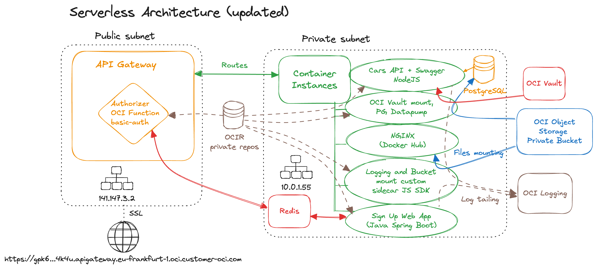

## Container Instances Cars API with Swagger, NGINX, OCI Logging, API Gateway with Authorizer Fn, Redis, PostgreSQL, OCI Vault

<table>
    <tr>
        <td width="200">
        
        

        Image by <a href="http://www.freepik.com">Freepik</a>
        </td>
        <td width="800">
        
        </td>
    </tr>
</table>
    

## Build containers

Build containers with GitHub Actions <a href=".github/workflows/containers.yml">pipeline</a>.

    
This requires three secrets:
<pre>
DOCKER_USERNAME
AUTH_TOKEN
TENANCY_NAMESPACE
</pre>
It uses <code>FRA</code> region for OCIR, i.e. Registry is <code>fra.ocir.io</code>

Note! Create the OCIR repos before running the pipeline:
<pre>
fra.ocir.io/$ns/ci-sidecar
fra.ocir.io/$ns/ci-sidecar-vault
fra.ocir.io/$ns/ci-sidecar-metrics
fra.ocir.io/$ns/cars-api
fra.ocir.io/$ns/ci-signup-web
</pre>
where <code>$ns</code> is <code>ns=$(oci os ns get | jq .data | tr -d '"')</code>

## Deploy CI stack

You can deploy the Container Instances stack from below with OCI Resource Manager (Terraform) 
or clone this repo to localhost and drag-drop the terraform folder to OCI Resource Manager when
creating a new Stack

    

